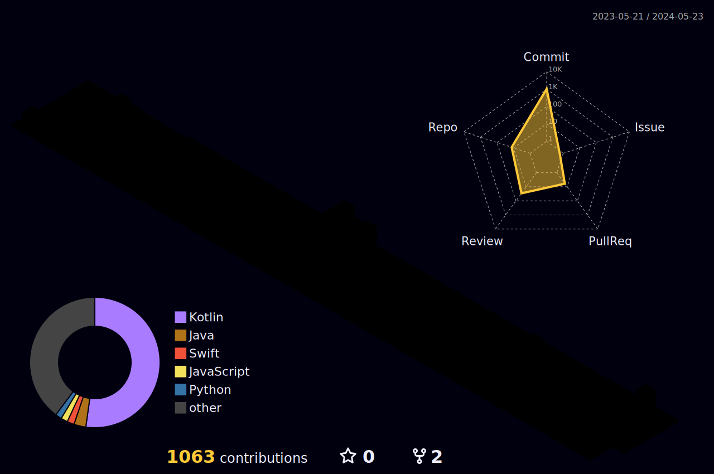

 
<a href="https://lh99j.github.io" style="margin-right:10px;"><a/>
<a href="https://lh99j.github.io/myblog/"><a/>

I'm Creative Android Developer with a Passion for Learning 🤗  
Sometimes I develop using the Java language. 🤭

I want to become a developer who continues to find my shortcomings and fill in the gaps.   
 

 ### 🌟 Skills & Language

 

 
 
 
 

   
 

 ### 🌟My Koding Skill

 

 ### 🌟My Farm

{: width="50%" height="50%"}

